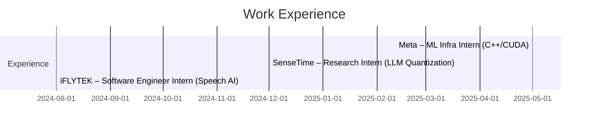

<!-- ╔══════════════════════════════════════════════════════════════╗ -->
<!-- ║                         ALLEN ZHU                            ║ -->
<!-- ║            High-Performance ML Systems Engineer              ║ -->
<!-- ╚══════════════════════════════════════════════════════════════╝ -->

  

<h1 align="center" style="font-size:34px;margin-top:-10px;">
  致瞬息万变之物 · 及亘古不变之物
</h1>

  <em>ML System Protection Association, save your GPU, save lives.</em>

---

<!-- ╔══════════════════════════════════════════════════════════════╗ -->
<!-- ║                           ABOUT ME                           ║ -->
<!-- ╚══════════════════════════════════════════════════════════════╝ -->
<h2>About&nbsp;Me</h2>

I’m **Allen Zhu** – I build **high-performance machine-learning systems**

- 🔬 **Now** — SWE Intern @ **Meta (Facebook) • AI Infra**
- ⚙️ **Before** — Research Intern @ **SenseTime • AI Lab** & SWE Intern @ **iFLYTEK • Speech AI**
- ✍️ **Writing** — large language model, machine learning systems, high performance computing (Medium / 知乎)  
- 🧐 **Seeking** — full-time **ML Systems / Infra** roles=
- 🎯 **Side quests** — photography, strategy games, pokemon enjoyer

---

<!-- ╔══════════════════════════════════════════════════════════════╗ -->
<!-- ║                        EXPERIENCE TIMELINE                   ║ -->
<!-- ╚══════════════════════════════════════════════════════════════╝ -->
### 🗂️ Timeline

---

<!-- ╔════════════════════════════════════════╗ -->
<!-- ║             TECH STACK                 ║ -->
<!-- ╚════════════════════════════════════════╝ -->
### 🧰 Tech Stack

| Languages | ML Systems / HPC | Cloud & DevOps |
|-----------|------------------|----------------|
|    |         |        |

---

<!-- ╔════════════════════════════════════════╗ -->
<!-- ║                CONTACT                 ║ -->
<!-- ╚════════════════════════════════════════╝ -->
### ☕ Reach Out

  
  
  

<!-- Last updated: 2025‑05‑01 -->
